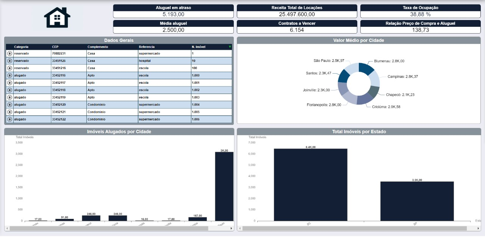

# Dashboard
O dashboard deste projeto foi desenvolvido para transformar dados complexos em informações acessíveis e úteis para a tomada de decisões no setor imobiliário. Ele oferece:

- Visualizações Dinâmicas: Gráficos interativos que permitem explorar o desempenho de locações e ocupação de imóveis.
- Interface Intuitiva: Design focado na experiência do usuário, facilitando o acesso rápido às informações relevantes.

