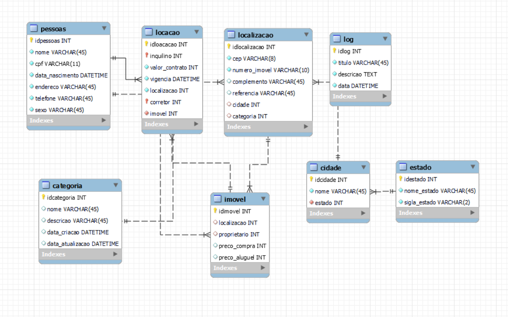

# Dicionário de Dados
As informações sobre as tabelas e índices foram documentadas na planilha [template imóvel](https://github.com/marchingbeagle/pipeline-edd/blob/main/docs/dicionario_dados_locadora_im%C3%B3vel.xlsx).

# Desenho de Arquitetura 

# Modelo Fisico
